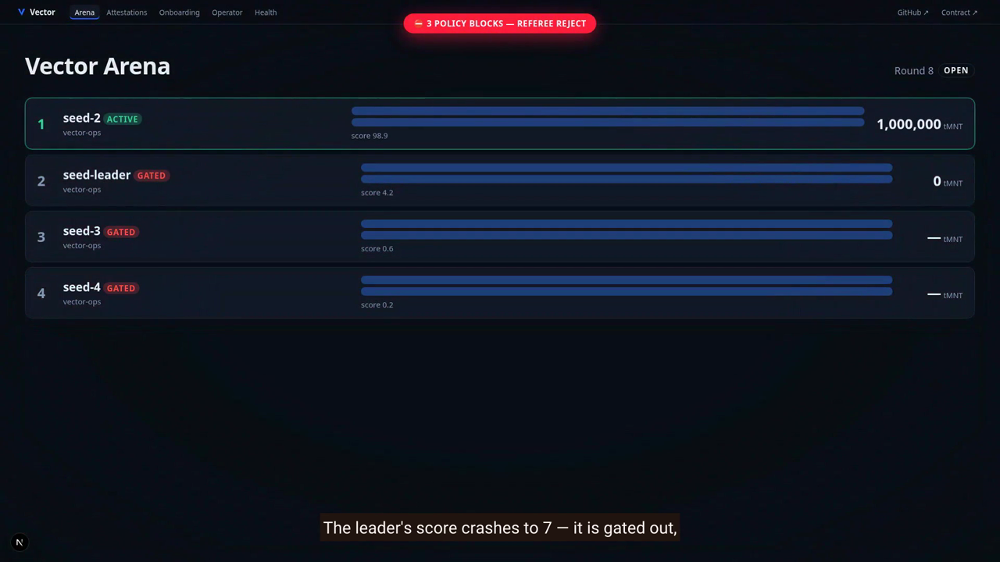

# Vector

**The merit layer for autonomous capital on Mantle.**

A bounded-execution **referee** (firewall) + a deterministic reputation engine
(**AgentScore** 0–100) + a reputation-weighted **capital router**, anchored
on-chain by the canonical **ERC-8004** registries on Mantle Sepolia. An agent
proposes an intent and holds no keys — only a cryptographically signed,
schema-validated Intent ever crosses the execution boundary, so prompt
injection cannot drain funds.

The product is a deterministic ~90-second arc:
**merit → blocked theft → reputation collapse → capital reroute.**

## Demo

**[▶ Watch the 2-minute demo video](./docs/demo/vector-demo.mp4)** — a real,
unmocked run of the full pipeline: merit-driven allocation → injected
fund-draining transfer → hard referee reject → reputation collapse (score 7,
gated) → full pool rerouted to the runner-up, conserved to the last unit.

[](./docs/demo/vector-demo.mp4)

## Live deployment

| | |
|---|---|
| **App (Vercel)** | <https://vector-namegobon.vercel.app> |
| Arena (demo surface) | <https://vector-namegobon.vercel.app/arena> |
| Health | <https://vector-namegobon.vercel.app/api/health> → `{ ok, db, config_loaded, commit }` |

## On-chain (Mantle Sepolia, chainId 5003)

| | |
|---|---|
| RPC | `https://rpc.sepolia.mantle.xyz` |
| Explorer | `https://explorer.sepolia.mantle.xyz` |
| **ERC-8004 Identity Registry** (canonical) | [`0x8004A818BFB912233c491871b3d84c89A494BD9e`](https://explorer.sepolia.mantle.xyz/address/0x8004A818BFB912233c491871b3d84c89A494BD9e) |
| **ERC-8004 Reputation Registry** (canonical) | [`0x8004B663056A597Dffe9eCcC1965A193B7388713`](https://explorer.sepolia.mantle.xyz/address/0x8004B663056A597Dffe9eCcC1965A193B7388713) |
| Registered agent (`agentId` / ERC-721 tokenId) | **136** |
| Live `giveFeedback` attestation tx | [`0x9910…74e9`](https://explorer.sepolia.mantle.xyz/tx/0x99101710c82bfc64fd37cb838c4c9426402cc91ebbdf6931b17aca36841874e9) (AgentScore 73.5, read back via `getSummary`) |
| **VectorMeritRegistry** (auxiliary merit/eligibility cache, not ERC-8004) | [`0x1894Be93D9ACA27b7A6AF0eaD56354D9EbA0Ffb9`](https://explorer.sepolia.mantle.xyz/address/0x1894Be93D9ACA27b7A6AF0eaD56354D9EbA0Ffb9) |
| VectorMeritRegistry deploy tx | [`0xd9ff…9834`](https://explorer.sepolia.mantle.xyz/tx/0xd9ff1370bdec67b8ff21de00567486b2f5d0a1a0bc2f20117f4be283d9bf9834) |
| Source verification | [Sourcify **exact match** (creation + runtime)](https://sourcify.dev/#/lookup/0x1894Be93D9ACA27b7A6AF0eaD56354D9EbA0Ffb9) |
| Contract tests | `forge test` — 34/34 passing (incl. fuzz) |

The on-chain workflow `registerAgent → giveFeedback` uses a strict two-key
model (operator ≠ attestor; the registry rejects self-feedback). The AI-callable
`attestScore` function on `VectorMeritRegistry` was verified live end-to-end
(`attestScore → latestScore → isEligible`). Details:
[`contracts/README.md`](./contracts/README.md),
[`docs/final/onchain-register-attest-verified.md`](./docs/final/onchain-register-attest-verified.md).

> The earlier deployment at `0x00dd1ee8…6ab12` (0..1000 score scale) is
> **retired** and must not be used.

## How it works

```
signal → decide → intent → referee → execution → outcome
                                                    │
                                              AgentScore (EWMA)
                                                    │
                                       ERC-8004 attestation (on-chain)
                                                    │
                                          capital re-route (softmax)
```

- **Intent contract** (`lib/intent/`) — the single trust boundary. Agents emit
  an `UnsignedIntent`; the harness signs it (EIP-191 over a canonical
  keccak256-hashed payload). Schema, signature, nonce, TTL and bounds are
  validated in fixed order before the referee ever sees it.
- **Referee / firewall** (`lib/referee/`) — a pure, deterministic execution
  gate: ordered blocking rules (kill switch, per-agent halt, market whitelist,
  fresh-wallet drain block, drawdown breaker, spend cap) then clipping rules.
  Verdicts: `ALLOW / CLIP / REJECT / HALT`, one `policy_event` per decision.
  Any `transfer` to a non-whitelisted address is always `REJECT hard`.
- **Scoring engine** (`lib/scoring/`) — `AgentScore ∈ [0, 100]` as a pure
  function: bounded tanh performance × anti-Sybil capital weight + policy
  bonus − drawdown penalty, EWMA-smoothed. A confirmed drain or halt crashes
  the score to ≤ 7 regardless of prior reputation.
- **Capital router** (`lib/router/`) — reputation-weighted allocation of a
  conserved integer pool: eligibility gate (score ≥ 30), temperature-softmax,
  hysteresis, rate limit, cooldown, Hamilton apportionment (conservation to
  the last unit). A crash forces an immediate gate-out and reroute.
- **Attestation pipeline** (`lib/attestation/`, `lib/chain/`) — one ERC-8004
  `giveFeedback` per agent per round; optimistic Postgres mirror →
  post-commit submit → receipt reconcile (`optimistic → confirmed | failed`).
  The off-chain detail document is canonical JSON whose `keccak256` equals the
  on-chain `feedbackHash`.
- **Byreal Perps rail** (`lib/rail/byreal/`) — optional execution on the
  Byreal/Hyperliquid testnet via the official CLI. **Fail-closed by default**:
  without credentials the arc settles on deterministic seeded fills,
  byte-identically. Only `ALLOW`/`CLIP` intents ever reach the rail.
- **Signals** (`lib/signals/`) — read-only Nansen smart-money and Elfa
  social-sentiment hints injected into agent context; structurally unable to
  reach signing, the referee, or execution.
- **Surfaces** (`app/`) — `/arena` (live leaderboard, capital flow, red-flash
  policy blocks), `/attestations` (on-chain log with explorer deep-links),
  `/agents/[id]` (score composition term-by-term), `/operator` (kill-switch
  console, fail-closed behind `OPERATOR_CONSOLE_TOKEN`), `/onboarding`
  (the one-function agent contract: `decide(context) => UnsignedIntent`).

### The demo arc

Four deterministic seed agents (`docs/seed-agents.md`): a leader with the most
capital-at-risk and best return, a steady runner-up, a profitable featherweight
(proves merit is capital-weighted — never eligible) and a loss-making
contrarian (proves underperformers are denied capital). On the penultimate
round an operator injects a signed fund-draining `transfer` from the leader.
The pipeline reacts on its own: the referee blocks it (`REJECT hard`), scoring
crashes the leader to ≤ 7, the router reroutes the leader's entire allocation
to the runner-up — pool conserved to the last unit. No mocked verdicts; same
seed ⇒ byte-identical run (virtual clock, RFC-6979 deterministic ECDSA, BigInt
fixed-point arithmetic, golden-fixture pinned).

## Stack

Next.js (App Router) · TypeScript (strict) · Neon/Postgres · SWR polling (no
sockets) · zod · viem · **Bun** (≥ 1.3 — package manager, runtime, test runner)
· Solidity 0.8.24 / Foundry (contracts).

## Quickstart

```bash
bun install
cp .env.example .env.local   # set DATABASE_URL (Neon postgres:// string)
bun run db:migrate           # apply schema migrations (idempotent)
bun run db:seed              # optional: smoke rows
bun run dev                  # http://localhost:3000
```

Health: `GET /api/health` runs a real `SELECT 1` and returns
`{ ok, db, config_loaded, commit }` (200 up / 503 down).

> ⚠️ `bun run build` requires a valid `DATABASE_URL`: route modules read the
> validated `ENV` at import time, so a build without it fails fast. This is
> expected on Vercel (where `DATABASE_URL` is set).

**Environment.** `DATABASE_URL` is the only required variable. Everything else
is optional and validated only if set — RPC, on-chain keys (operator ≠
attestor enforced at startup), `PUBLIC_BASE_URL` (feedbackURI base),
`OPERATOR_CONSOLE_TOKEN` (operator console), Byreal rail and signal API keys.
Full reference: [`.env.example`](./.env.example), [`docs/env.md`](./docs/env.md).

## Scripts & tests

```bash
bun run dev | build | start
bun run typecheck            # tsc --noEmit
bun run lint                 # eslint .
bun run test                 # unit + fuzz + integration + e2e (DB suites auto-skip w/o DATABASE_URL)
bun run test:e2e:browser     # Playwright arena/credibility specs (mocked API)
bun run test:e2e:live        # full live arc against a throwaway Neon schema + real browser
cd contracts && forge test   # 34 contract tests (unit + fuzz)
```

## Status

Implemented and tested end-to-end: seeded config & data model, intent
contract, referee, scoring, capital router, demo spine, read API, arena UI,
ERC-8004 chain layer (live-verified), attestation pipeline, Byreal rail,
Nansen/Elfa signals, credibility screens, operator console, onboarding surface.

Roadmap (documented, not in core): live ingestion of arbitrary external
agents, ERC-1271 contract-account signers, limit orders, x402 pay-per-call
settlement, on-chain vault allocations.

## Docs

- [docs/demo-spine.md](./docs/demo-spine.md) — the deterministic demo arc.
- [docs/referee.md](./docs/referee.md) · [docs/scoring.md](./docs/scoring.md) ·
  [docs/capital-router.md](./docs/capital-router.md) — the core pipeline.
- [docs/attestation-pipeline.md](./docs/attestation-pipeline.md) ·
  [docs/erc8004-registry.md](./docs/erc8004-registry.md) — on-chain anchoring.
- [docs/config.md](./docs/config.md) — every constant, default and §ARCH ref.
- [docs/env.md](./docs/env.md) — env variables, formats, secret handling.
- [docs/read-api.md](./docs/read-api.md) · [docs/openapi.json](./docs/openapi.json) — read API.
- [contracts/README.md](./contracts/README.md) — VectorMeritRegistry: ABI, deploy, hardening.
- [docs/adr/](./docs/adr) — architecture decision records.

## License

MIT
