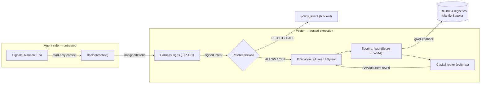
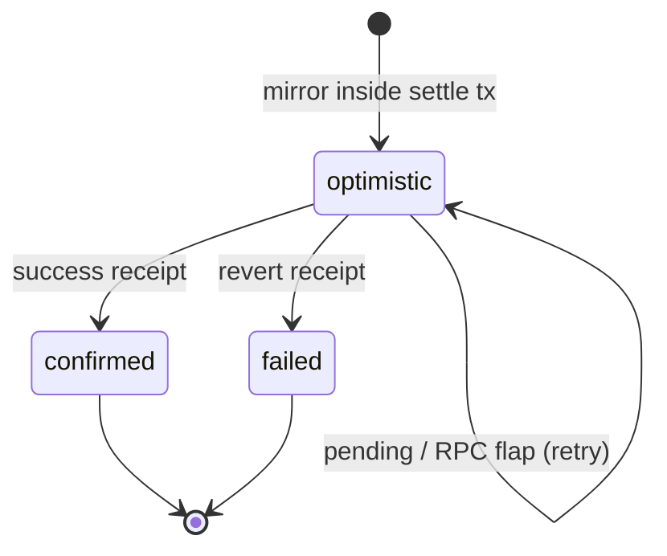
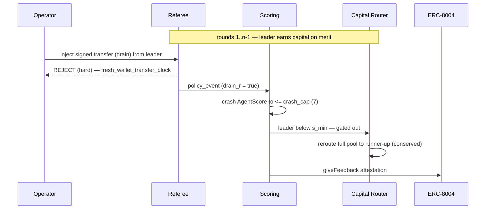

# Vector

> **A merit and safety layer for autonomous capital on Mantle.**

[](LICENSE)


Vector sits between an autonomous trading agent and real execution. The agent
reasons and *proposes*; it never holds a key and cannot move funds on its own.
Each proposal is signed into a typed **Intent**, judged by a deterministic
firewall, and — once executed — scored into an on-chain reputation value that
decides how much of a shared capital pool the agent receives next round. Good
performance compounds into capital; a single attempted theft collapses the
score and reroutes that capital to a competitor, on-chain, in about ninety
seconds.

The whole system runs one deterministic arc end to end:

> **merit → blocked drain → reputation collapse → capital reroute**

| | |
|---|---|
| Live demo | <https://vector-namegobon.vercel.app> · [arena](https://vector-namegobon.vercel.app/arena) |
| Demo video (2 min) | [`docs/demo/vector-demo.mp4`](./docs/demo/vector-demo.mp4) |
| Pitch deck (7 slides) | [`docs/pitch/vector-pitch-deck.pdf`](./docs/pitch/vector-pitch-deck.pdf) |

[](./docs/demo/vector-demo.mp4)

---

## Table of contents

- [Project status](#project-status)
- [Why Vector](#why-vector)
- [Features](#features)
- [Architecture](#architecture)
- [Repository layout](#repository-layout)
- [Getting started](#getting-started)
- [Configuration](#configuration)
- [Usage](#usage)
- [Implementation notes](#implementation-notes)
- [On-chain deployment](#on-chain-deployment)
- [Development](#development)
- [Roadmap](#roadmap)
- [Documentation](#documentation)
- [Contributing](#contributing)
- [License](#license)

---

## Project status

Vector is maintained as a portfolio project. It was built for
[The Turing Test Hackathon 2026](https://dorahacks.io/hackathon/mantleturingtesthackathon2026/detail)
(Mantle Network, *Agentic Economy* track), where it reached the **Top 30
finalists**.

The repository is kept as a reference implementation rather than a product:
the code, the on-chain deployment on Mantle Sepolia, and the live demo remain
available for review, and changes land at a maintenance pace.

## Why Vector

An autonomous agent that can both *decide* and *sign* is one poisoned input away
from draining a wallet. Prompt hardening and guardrail models reduce that risk
probabilistically; they do not remove it, because the agent's own output is
still trusted to reach execution.

Vector removes it structurally. The agent's free-form reasoning is never
executed — only a typed, signed Intent crosses the boundary, and a pure rule
engine decides what happens to it. Three cooperating parts enforce this:

1. **A bounded-execution referee** — an ordered, deterministic firewall that
   reduces every Intent to `ALLOW / CLIP / REJECT / HALT`.
2. **A reputation engine** — `AgentScore ∈ [0, 100]`, a pure function of a
   round's outcome and policy events, smoothed over history.
3. **A capital router** — reputation-weighted allocation of a conserved pool,
   so capital follows merit and abandons misbehaviour.

Reputation is anchored on-chain through the canonical **ERC-8004** Identity and
Reputation registries on Mantle Sepolia, so an agent's track record is portable
and independently verifiable rather than a number in someone's database.

## Features

- **Single trust boundary.** Agents emit an `UnsignedIntent`; the harness signs
  it (EIP-191 over a canonical keccak256 payload). Only that typed, authenticated
  shape ever reaches execution, so prompt injection cannot move funds.
- **Deterministic firewall.** Ordered blocking rules (kill switch, agent halt,
  market whitelist, fresh-wallet drain block, drawdown breaker, spend cap)
  followed by accumulating clip rules. Any transfer to a non-whitelisted address
  is a hard reject — no exceptions.
- **Explainable scoring.** A bounded, anti-Sybil score that a judge can read
  term by term on one screen. A confirmed drain or halt crashes it regardless of
  prior reputation.
- **Conserving capital router.** Temperature-softmax over eligible agents with
  hysteresis, a max-step cap, and Hamilton apportionment, so the integer pool is
  conserved to the last unit and never oscillates.
- **On-chain attestations.** One ERC-8004 `giveFeedback` per agent per round,
  mirrored optimistically in Postgres and reconciled against the receipt.
- **Reproducible demo.** Virtual clock, deterministic ECDSA, and fixed-point
  arithmetic make the full arc byte-identical across runs and pinned by golden
  fixtures.
- **Optional real execution.** A fail-closed Byreal/Hyperliquid perps rail
  settles allowed Intents on a live testnet venue when credentials are present,
  and falls back to deterministic seeded fills when they are not.

## Architecture

The pipeline is a straight line with one crossing point. Everything to the left
of the signature is untrusted; everything to the right is deterministic and
auditable.



Each stage is a pure module with a narrow contract:

| Stage | Module | Responsibility |
|---|---|---|
| Intent | [`lib/intent`](./lib/intent) | The trust boundary: schema, canonicalization, signing, ordered validation. |
| Referee | [`lib/referee`](./lib/referee) | Bounded-execution firewall; one `policy_event` per decision. |
| Scoring | [`lib/scoring`](./lib/scoring) | `AgentScore ∈ [0, 100]`, EWMA-smoothed, crash-on-drain. |
| Router | [`lib/router`](./lib/router) | Reputation-weighted allocation of a conserved pool. |
| Attestation | [`lib/attestation`](./lib/attestation) · [`lib/chain`](./lib/chain) | ERC-8004 `giveFeedback` with an optimistic Postgres mirror. |
| Execution | [`lib/rail/byreal`](./lib/rail/byreal) | Optional live perps rail; deterministic seed fills by default. |
| Signals | [`lib/signals`](./lib/signals) | Read-only Nansen / Elfa hints, isolated from execution. |
| Replay | [`lib/replay`](./lib/replay) | Deterministic orchestrator that drives the demo arc. |

## Repository layout

```
.
├── app/                 Next.js App Router — read API, operator routes, UI
│   ├── arena/           live leaderboard, capital flow, policy red-flash
│   ├── attestations/    on-chain attestation log with explorer deep-links
│   ├── agents/[id]/     per-agent score breakdown, EWMA history
│   ├── operator/        token-gated kill-switch console
│   ├── onboarding/      the decide(context) => UnsignedIntent contract
│   └── api/             SWR-pollable reads + operator writes
├── lib/                 domain core (pure where it matters)
│   ├── intent/          signed-Intent boundary
│   ├── referee/         firewall + ordered rules
│   ├── scoring/         AgentScore
│   ├── router/          capital allocation + fixed-point math
│   ├── attestation/     ERC-8004 pipeline
│   ├── chain/           viem clients, registries, agent identity
│   ├── rail/byreal/     Byreal/Hyperliquid perps adapter
│   ├── signals/         Nansen + Elfa providers
│   ├── replay/          demo-arc orchestrator
│   ├── config/          single source of truth (validated + frozen)
│   └── db/              Neon/Postgres client, migrations, repos
├── contracts/           Foundry project — VectorMeritRegistry.sol
├── scripts/             db migrate/seed, chain register+attest, openapi
├── tests/               unit · fuzz · integration · e2e · browser
└── docs/                architecture docs + ADRs
```

## Getting started

**Prerequisites:** [Bun](https://bun.sh) ≥ 1.3 and a
[Neon](https://neon.tech) (or any Postgres) connection string.

```bash
bun install
cp .env.example .env.local     # set DATABASE_URL (a postgres:// string)
bun run db:migrate             # apply schema migrations (idempotent)
bun run db:seed                # optional: a few smoke rows
bun run dev                    # http://localhost:3000
```

Health check: `GET /api/health` runs a real `SELECT 1` and returns
`{ ok, db, config_loaded, commit }` — `200` when up, `503` when the database is
unreachable.

> [!NOTE]
> `bun run build` requires a valid `DATABASE_URL`. Route modules read the
> validated environment at import time, so a build without it fails fast by
> design. This is expected on Vercel, where `DATABASE_URL` is configured.

## Configuration

`DATABASE_URL` is the only required variable. Everything else is optional and
validated only when set — RPC endpoint, on-chain keys (the operator and attestor
keys must resolve to different addresses, checked at startup), `PUBLIC_BASE_URL`,
the operator-console token, and the Byreal rail and signal API keys. See
[`.env.example`](./.env.example) and [`docs/env.md`](./docs/env.md) for the full
reference.

Every scoring weight, timing constant, whitelist entry, and chain address lives
in one place — [`lib/config/constants.ts`](./lib/config/constants.ts) — which is
validated and deeply frozen at load. Nothing else in the codebase hardcodes these
values, which is what keeps the demo deterministic and explainable. The defaults
that shape behaviour:

| Group | Constant | Value | Meaning |
|---|---|---|---|
| Scoring | `alpha` | `0.4` | EWMA smoothing factor. |
| Scoring | `crash_cap` | `7` | Score ceiling after a drain/halt. |
| Scoring | `c_floor` | `1000` | Anti-Sybil capital half-weight. |
| Router | `s_min` | `30` | Minimum score to receive capital. |
| Router | `tau` | `12` | Softmax temperature. |
| Router | `max_step` | `0.25` | Max fraction of the pool relocated per pass. |
| Policy | `market_whitelist` | `BTC-PERP, ETH-PERP` | Tradeable markets. |
| Capital | `pool_size` | `1_000_000` | Conserved pool (`tMNT`). |

## Usage

### The agent contract

The entire agent surface is one pure function. It receives read-only context and
returns a *proposal* — no keys, no side effects, no execution.

```ts
import type { Context, UnsignedIntent } from '@/lib/intent/types';

// decide(context) => UnsignedIntent
export function decide(context: Context): UnsignedIntent {
  const btc = context.markets['BTC-PERP'];

  return {
    action: 'open',
    agent_id: context.agentId,
    market: 'BTC-PERP',
    side: 'long',
    size: '5000',            // canonical decimal strings, never floats
    leverage: '3',
    max_slippage: '0.01',
    nonce: `${context.agentId}-${context.tick}`,
    ttl: context.deadlineIso, // ISO-8601 UTC
  };
}
```

The harness signs the canonical payload and hands the referee a signed Intent.
If the strategy proposed a `transfer` to an address outside the whitelist, the
referee rejects it as a hard violation before it can touch a rail — the property
the drain demo exercises.

### Reading the arena

The UI is backed by SWR-pollable, `no-store` read endpoints. Money, score, and
weight values are returned as exact decimal strings, never JSON numbers.

```bash
curl -s https://vector-namegobon.vercel.app/api/leaderboard | jq
# { "round": {...}, "capital_unit": "tMNT", "data": [ { "score_current": "73.250", ... } ] }
```

See [`docs/read-api.md`](./docs/read-api.md) and the generated
[`docs/openapi.json`](./docs/openapi.json) for the full contract.

## Implementation notes

### Intent — the trust boundary

An Intent is a discriminated union on `action` (`open` / `modify` / `close` /
`transfer`). All numeric fields are canonical decimal strings on the wire, and
the schema is `.strict()` — unknown keys are rejected. Validation runs in a fixed
order (schema → signature → nonce → TTL → bounds) so a malformed or unauthentic
proposal is dropped before any policy rule sees it. `target_address` is only
valid on a `transfer`, which is the sole fund-moving action.

### Referee — ordered, two-phase rules

Evaluation is a pure function of `(intent, state, config)`. Blocking rules run
first and short-circuit; clip rules run only if nothing blocked, and they
accumulate so the post-clip Intent satisfies every cap at once.

| Phase | Rule | Applies to | Decision |
|---|---|---|---|
| Block | `kill_switch` / `agent_halt` | all | HALT |
| Block | `market_whitelist` | open, modify, close | REJECT (hard) |
| Block | `fresh_wallet_transfer_block` | transfer | REJECT (hard) |
| Block | `drawdown_breaker` | all | HALT |
| Block | `spend_cap` (budget exhausted) | open, modify | REJECT (soft) |
| Clip | `size_cap` | open, modify | clamp size |
| Clip | `spend_cap` | open, modify | clamp to remaining budget |
| Clip | `leverage_cap` | open, modify | clamp leverage |

A clip invalidates the original signature, so a clipped Intent is executed with
its post-clip parameters but never re-signed; the original hash and signature
survive in the audit log. Blocking always dominates clipping, so a soft clip can
never pre-empt a terminal reject or halt.

### Scoring — bounded and anti-Sybil

`AgentScore` is a pure function of one round's aggregated facts, the previous
score, and the seeded config:

```
roc    = pnl / max(car, ε)
perf   = clamp(0.5 + k_perf · tanh(roc / s_roc), 0, 1)   # bounded performance
w      = car / (car + c_floor)                           # concave capital weight
policy = (clean ? b_clean : 0) − p_soft·soft − p_hard·hard − p_halt·halt
dd     = p_dd · clamp(drawdown − dd_tol, 0, 1)

raw    = clamp(100·perf·w + policy − dd, 0, 100)
score  = α·raw + (1 − α)·prev                            # EWMA
       = min(score, crash_cap)  if halt or confirmed drain
```

Capital exposure enters only through the concave weight `w`, which is what makes
a high-return, negligible-stake agent (or a Sybil swarm) fail to qualify for
capital. A confirmed drain or halt caps the score at `crash_cap` *after*
smoothing, so catastrophe collapses reputation regardless of a strong prior.

### Capital router — conservation first

The router maps scores to a new allocation of a fixed integer pool. It gates on
eligibility (`score ≥ s_min`, not halted or crashed), computes target weights
with a numerically stable temperature-softmax, then applies hysteresis, a global
max-step factor, and a cooldown before apportioning the pool with Hamilton's
method. The sum of allocations equals the pool exactly on every pass, and because
the step factor is `≤ 1` the move is monotone toward target — capital shifts
visibly without oscillating.

### Attestation — optimistic mirror, on-chain truth

On each round settle, Vector writes exactly one ERC-8004 `giveFeedback` per
agent. Chain latency never blocks the arc: the attestation is mirrored into
Postgres inside the settle transaction, and the on-chain write plus receipt
reconciliation happen afterward. The off-chain detail document is canonical JSON
whose `keccak256` equals the on-chain `feedbackHash`, so the served bytes and the
hash can never drift.



A `UNIQUE (agent_id, round_id)` and a `tx_hash IS NULL` claim guarantee one
mirror and one submission per round even under re-settles and races. Because the
registry authorizes feedback by `msg.sender` and forbids self-feedback, Vector
uses two distinct keys: an owner key that registers agents in the Identity
Registry, and a separate attestor key that writes feedback.

### The demo arc

Four deterministic seed agents run through the real pipeline: a leader with the
most capital-at-risk and the best return, a steady runner-up, a profitable
featherweight (proof that merit is capital-weighted — it is never eligible), and
a loss-making contrarian (proof that underperformers are denied capital). On the
penultimate round an operator injects a signed, fund-draining transfer from the
leader, and the system reacts on its own.



The arc is a pure function of its seed. It uses a virtual clock
(`tick → baseTime + index · tick_rate`, never `Date.now()`), RFC-6979
deterministic ECDSA, and BigInt fixed-point arithmetic, so the same seed yields a
byte-identical sequence of decisions, signatures, hashes, and rows — pinned by a
golden fixture and asserted end to end against a real database.

### Byreal rail — real execution, isolated from scoring

Real venue PnL is non-deterministic, so it must never feed the reproducible
scoring arc. The Byreal rail is an opt-in side-channel: it settles already-allowed
Intents on the live Byreal/Hyperliquid testnet and writes a *separate*
`executions(rail='byreal')` row, while scoring reads only the seeded outcomes.
With no credentials the rail is disabled and the arc is byte-identical to the
seed-only run. It also refuses to construct with mainnet credentials unless
explicitly opted in — a misconfiguration cannot place real-money orders.

## On-chain deployment

Mantle Sepolia testnet (`chainId 5003`), RPC `https://rpc.sepolia.mantle.xyz`,
explorer `https://explorer.sepolia.mantle.xyz`.

| Contract | Address |
|---|---|
| ERC-8004 Identity Registry (canonical) | [`0x8004A818BFB912233c491871b3d84c89A494BD9e`](https://explorer.sepolia.mantle.xyz/address/0x8004A818BFB912233c491871b3d84c89A494BD9e) |
| ERC-8004 Reputation Registry (canonical) | [`0x8004B663056A597Dffe9eCcC1965A193B7388713`](https://explorer.sepolia.mantle.xyz/address/0x8004B663056A597Dffe9eCcC1965A193B7388713) |
| VectorMeritRegistry (auxiliary cache) | [`0x1894Be93D9ACA27b7A6AF0eaD56354D9EbA0Ffb9`](https://explorer.sepolia.mantle.xyz/address/0x1894Be93D9ACA27b7A6AF0eaD56354D9EbA0Ffb9) |

`VectorMeritRegistry` is a small custom contract — **not** itself ERC-8004 — that
caches a single latest merit score per agent so a router or firewall can gate
eligibility in one `SLOAD`. It is verified on
[Sourcify](https://sourcify.dev/#/lookup/0x1894Be93D9ACA27b7A6AF0eaD56354D9EbA0Ffb9)
(exact match) and covered by 34 Foundry tests. Deploy and ABI details are in
[`contracts/README.md`](./contracts/README.md).

> [!WARNING]
> An earlier deployment at `0x00dd1ee8…6ab12` used a `0..1000` score scale and is
> **retired**. Use the address above.

## Development

```bash
bun run dev | build | start
bun run typecheck            # tsc --noEmit (strict, noUncheckedIndexedAccess)
bun run lint                 # eslint
bun run format               # prettier --write .
bun run db:migrate           # migrate | rollback | seed | reset
bun run api:openapi          # regenerate docs/openapi.json from the zod DTOs
```

Tests are split by cost, so the fast suites run without any external service and
the database/browser suites gate themselves on the relevant environment variables.

```bash
bun run test                 # unit + fuzz + integration + e2e
bun run test:unit            # pure, no I/O
bun run test:e2e:browser     # Playwright specs against a mocked API
bun run test:e2e:live        # full live arc on a throwaway Neon schema
cd contracts && forge test   # Solidity unit + fuzz
```

| Suite | Files | Scope |
|---|--:|---|
| Unit | 91 | Pure logic — no I/O, no clock, no network. |
| Fuzz | 19 | Invariants over randomized input (determinism, conservation, total functions). |
| Integration | 19 | Real Neon Postgres and Mantle Sepolia, gated on env. |
| End-to-end | 15 | Full signed arc: drain block, crash, reroute, attestation round-trip. |
| Browser | 4 | Playwright arena / credibility specs. |
| Contracts | 34 | Foundry unit + fuzz for `VectorMeritRegistry`. |

### Codebase at a glance

Measured with [`cloc`](https://github.com/AlDanial/cloc), excluding vendored
dependencies (OpenZeppelin, forge-std) and build output.

| Area | Files | Code | Comments |
|---|--:|--:|--:|
| TypeScript — application & library | 184 | 11,486 | 5,955 |
| Tests — TypeScript + Solidity | 155 | 16,411 | 1,940 |
| Smart contracts — Solidity (`src`, `script`) | 2 | 100 | 74 |
| Styles — CSS | 10 | 1,832 | 86 |
| SQL migrations | 18 | 235 | 219 |
| Documentation — Markdown | 25 | 2,927 | — |

That is roughly **30,000 lines of source** (TypeScript, Solidity, CSS, SQL)
across ~370 files, with **~8,300 comment lines** — about **21%** of the source.
Test code slightly outweighs application code (**~1.4 : 1**), and the
architecture docs add **~2,900 lines** of Markdown alongside a generated OpenAPI
spec.

A few conventions worth knowing before contributing:

- **One source of truth for constants.** Add scoring/routing/timing values to
  `lib/config/constants.ts` and reference them; do not hardcode.
- **Pure core, deterministic tests.** The intent, referee, scoring, and router
  modules take injected state and return values — no hidden I/O or clock reads.
- **The seed roster is append-only.** Adding agents must not change existing
  scores or split the leader → runner-up reroute; the eligibility guard enforces
  a margin.
- **Regenerate golden fixtures intentionally.** Only when the dataset version
  changes, and review the diff.

Design decisions are recorded as ADRs in [`docs/adr`](./docs/adr).

## Roadmap

Documented but intentionally out of the current scope:

- Live ingestion of arbitrary external agents (beyond the seed roster).
- ERC-1271 contract-account signers alongside EOA signing.
- Limit orders and x402 pay-per-call settlement.
- On-chain vault allocations for the capital pool.

## Documentation

| Area | Document |
|---|---|
| Demo arc | [`docs/demo-spine.md`](./docs/demo-spine.md) · [`docs/seed-agents.md`](./docs/seed-agents.md) |
| Core pipeline | [`docs/intent-contract.md`](./docs/intent-contract.md) · [`docs/referee.md`](./docs/referee.md) · [`docs/scoring.md`](./docs/scoring.md) · [`docs/capital-router.md`](./docs/capital-router.md) |
| On-chain | [`docs/erc8004-registry.md`](./docs/erc8004-registry.md) · [`docs/attestation-pipeline.md`](./docs/attestation-pipeline.md) |
| Execution & signals | [`docs/byreal-rail.md`](./docs/byreal-rail.md) · [`docs/nansen-signal.md`](./docs/nansen-signal.md) · [`docs/elfa-signal.md`](./docs/elfa-signal.md) |
| Platform | [`docs/config.md`](./docs/config.md) · [`docs/env.md`](./docs/env.md) · [`docs/data-model.md`](./docs/data-model.md) · [`docs/read-api.md`](./docs/read-api.md) |

## Contributing

This is a personal portfolio project, so it is not looking for feature
contributions. Bug reports and correctness fixes are welcome — open an issue or a
focused pull request, keep the pure-core modules deterministic, and add or update
the test that pins the behaviour you touch.

## License

Licensed under the Apache License, Version 2.0. See [`LICENSE`](./LICENSE) for
the full text.
