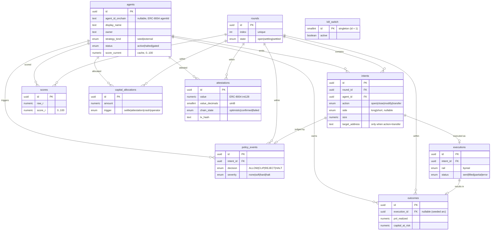

# Vector data model (Neon / Postgres)

> Implements §7 of the architecture spec. **Neon is truth for speed/UI; the
> ERC-8004 write is truth for trust.** On-chain facts are mirrored into Neon with
> a `chain_state` (`optimistic` / `confirmed` / `failed`) and a `tx_hash`.

The schema lives in [`lib/db/migrations/0001_data_model.up.sql`](../lib/db/migrations/0001_data_model.up.sql)
(the SQL DDL is the source of truth); [`lib/db/schema.ts`](../lib/db/schema.ts)
mirrors the enum domains and row shapes for the typed repository layer.

## ER diagram



## Tables

Every `id` is a `uuid` (default `gen_random_uuid()`) unless noted; every
timestamp is `timestamptz`; every money/score/CaR column is `numeric` (never
float). All FKs are `ON UPDATE CASCADE ON DELETE RESTRICT` — a parent with
children cannot be deleted, so there are never dangling references.

| Table | Purpose | Key constraints |
|---|---|---|
| `agents` | One row per competing agent. `score_current` is a denormalized cache of the latest `score_r`. | `agent_id_onchain` unique & nullable; `score_current ∈ [0,100]`. |
| `rounds` | One row per replay round. | `index` unique & `≥ 0`. |
| `intents` | Every `decide() → Intent`, signed, with referee-relevant fields first-class. | `target_address` non-null **only** when `action = 'transfer'` (check); `size`/`leverage`/`max_slippage ≥ 0`. |
| `policy_events` | Referee decision stream; drives the red-alert UI and scoring penalties. | `decision`/`severity` enums (distinct domains). |
| `executions` | Rail orders (Byreal). | `status` enum; FK → `intents`. |
| `outcomes` | Realized/marked PnL, CaR, fees, drawdown per execution. | `execution_id` **nullable** (seeded arc, rail=seed); `capital_at_risk`/`fees`/`drawdown ≥ 0`. |
| `scores` | Per-round AgentScore with an explainability breakdown. | `score_r ∈ [0,100]`; unique `(agent_id, round_id)`. |
| `capital_allocations` | Reputation-weighted re-allocations (§6.2). | `trigger ∈ {settle, attestation, crash, operator}`; weights ∈ `[0,1]`; `amount ≥ 0`. |
| `attestations` | Per-round ERC-8004 mirror. | unique `(agent_id, round_id)`; `value` bounded to int128; `value_decimals ∈ [0,255]`; `feedback_hash`/`tx_hash` must be `0x`+64 hex. |
| `kill_switch` | Operator circuit breaker. | **singleton**: `id smallint PK DEFAULT 1` + `CHECK (id = 1)`. |

### Enum domains

Named separately on purpose — one label (`status`) would hide two different
domains:

- `agents.status` — `active` / `halted` / `gated` (operator / router gate)
- `executions.status` — `sent` / `filled` / `partial` / `error`
- `agents.strategy_kind` — `seed` / `external`
- `rounds.state` — `open` / `settling` / `settled`
- `intents.action` — `open` / `close` / `modify` / `transfer` (`withdraw` is a
  descriptive synonym of `transfer`; there is **no** separate value)
- `intents.side` — `long` / `short` (nullable; only for open/modify)
- `policy_events.decision` — `ALLOW` / `CLIP` / `REJECT` / `HALT`
- `policy_events.severity` — `none` / `soft` / `hard` / `halt`
- `executions.rail` — `byreal`
- `capital_allocations.trigger` — `settle` / `attestation` / `crash` / `operator`
  (§7.1 lists three; §6.2 also requires `attestation`, so the domain is widened
  to keep the attestation-confirmed re-route recordable for P1.3)
- `attestations.chain_state` — `optimistic` / `confirmed` / `failed`

## Truth map (§7.2): off-chain vs on-chain

| Datum | Off-chain (Neon) | On-chain (Mantle) | Source of truth |
|---|---|---|---|
| Intents, policy events, executions, outcomes | full detail | — | Neon |
| Score history | full | latest reflected via attestation `value` | Neon for history; chain for the anchored snapshot |
| Reputation attestation (per round) | mirror + `chain_state` | ERC-8004 Reputation Registry write | **Chain** (Neon mirror reconciles) |
| Capital allocations | full | — (ROADMAP: vault) | Neon |
| Off-chain feedback detail | served at `feedback_uri`, hashed by `feedback_hash` | hash only | Neon, integrity-anchored on chain |

## Indexes (for the P1.5 read patterns)

- Leaderboard: `idx_agents_score_current` on `agents(score_current DESC)`.
- Agent detail: `idx_intents_agent_created` on `intents(agent_id, created_at DESC)`;
  `idx_policy_events_agent_created` on `policy_events(agent_id, created_at DESC, id DESC)`;
  `idx_outcomes_agent_round`; `scores(agent_id, round_id)` (unique).
- Policy feed by time: `idx_policy_events_created`, `idx_policy_events_round_created`.
- Attestation feed: `idx_attestations_created` on `attestations(created_at DESC, id DESC)`;
  `idx_attestations_chain_state_created` on `attestations(chain_state, created_at DESC, id DESC)`
  (serves both the `chain_state`-filtered feed and the reconcile read).
- Plus FK-supporting indexes on `round_id` / `intent_id` columns.

## Repository layer

[`lib/db/repos/*`](../lib/db/repos) exposes typed, parameterized `insert*` /
`get*` / `list*` helpers per table. Each takes a `Queryable` (a pool **or** a
transaction client) as its first argument, so the same functions work inside a
transaction and are unit-testable with an injected fake. Values are **always**
bound as `$n` parameters (see [`lib/db/sql.ts`](../lib/db/sql.ts)); identifiers
are validated against a strict pattern. `numeric` columns are represented as
decimal **strings** end-to-end to preserve precision.

## Migration runbook

The runner ([`lib/db/migrate.ts`](../lib/db/migrate.ts)) is a thin layer over the
Neon client (no ORM). It records applied versions in a `schema_migrations`
ledger, applies each migration in its own transaction (atomic), and takes a
session **advisory lock** so two processes can't migrate concurrently.

```bash
# Apply all pending migrations (idempotent).
DATABASE_URL='postgres://…' bun run db:migrate

# Roll back: most recent / N steps / down to a version / everything.
DATABASE_URL='postgres://…' bun run db:rollback
DATABASE_URL='postgres://…' bun run db:rollback 2
DATABASE_URL='postgres://…' bun run db:rollback --to 0001
DATABASE_URL='postgres://…' bun run db:rollback --all

# Idempotent smoke seed (one row per table) — assumes schema is migrated.
DATABASE_URL='postgres://…' bun run db:seed

# Full reset: down → up → re-seed (DESTRUCTIVE; drops all data).
DATABASE_URL='postgres://…' bun run db:reset
```

**Concurrency.** Migrations are serialized by `pg_advisory_lock`; a second
runner blocks until the first finishes, then finds nothing to do. Each migration
commits atomically, so a mid-migration failure leaves neither partial DDL nor a
ledger row.

**Tests.** Run the suites as separate processes (mock-based unit/fuzz must not
share a process with the real-DB suites, because bun's `mock.module` is
process-global):

```bash
bun run test:unit && bun run test:fuzz          # no database required
DATABASE_URL='postgres://…' bun run test:integration
DATABASE_URL='postgres://…' bun run test:e2e
# or all four in sequence:
DATABASE_URL='postgres://…' bun run test
```

Integration and e2e tests run inside a throwaway `vec_test_*` / `vec_e2e_*`
schema (created, migrated, asserted, then `DROP SCHEMA … CASCADE`), so they
never see or pollute other data and can run concurrently.
